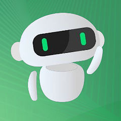
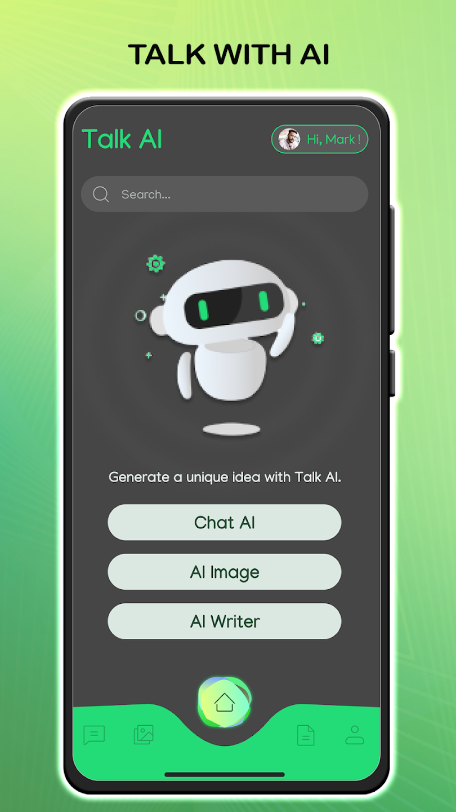
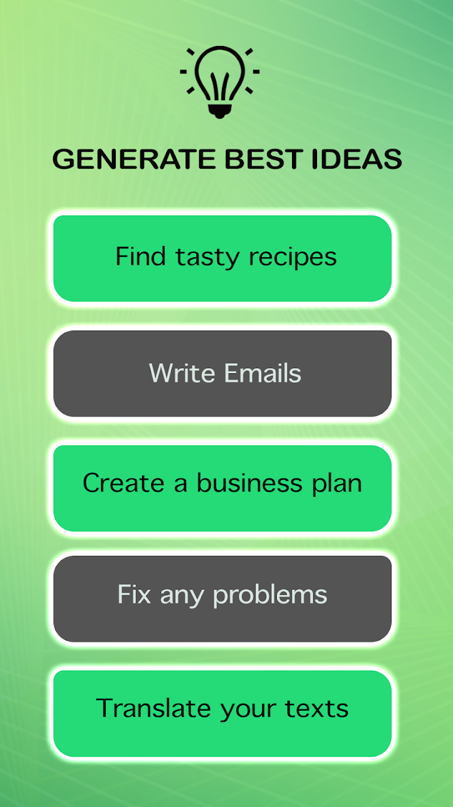
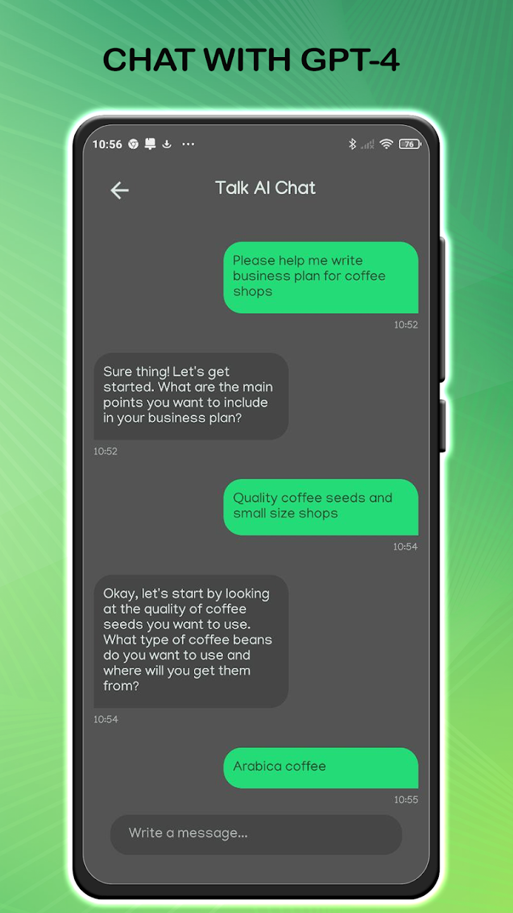
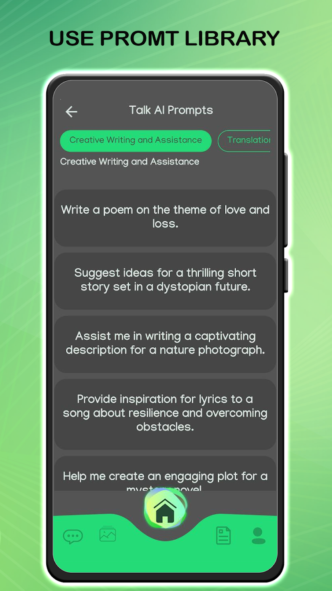
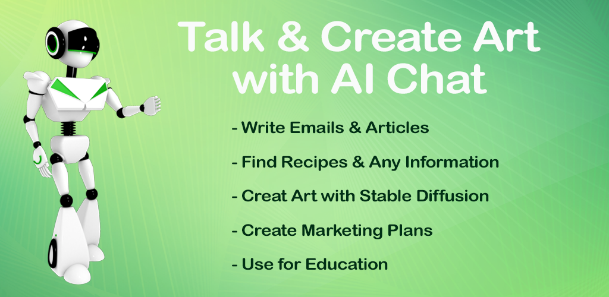

    

        

         
        
    
    
    

  
> **Note**

Version 1.04 Talk AI - Chat & Art Creator

## About This APP
Welcome to our amazing AI-powered chat app, featuring an advanced Talk AI chatbot and ChatGPT functionality. Our app utilizes state-of-the-art artificial intelligence (AI) technology to provide you with an exceptional conversational experience.

Our AI chatbot employs natural language processing and machine learning algorithms to engage in intelligent and human-like conversations. Chat with our AI chatbot and explore its vast knowledge base, as it assists you with information, recommendations, problem-solving, and more. Experience the future of communication with our AI chatbot, where your queries are met with prompt and accurate responses.

Powered by ChatGPT, our app takes conversational AI to the next level. ChatGPT is an advanced language model that understands context, generates coherent responses, and engages in meaningful discussions. Immerse yourself in captivating conversations with ChatGPT, where you can delve into various topics, seek advice, brainstorm ideas, and even enjoy entertaining interactions.

The Talk AI app assistant gives you the ability to download and use your own data to train our model. You can submit your text data such as documents, emails, messages or any other information and our AI chat will learn from this data. This will allow the AI to better understand your context, offer more accurate and personalised responses, and easily perceive your unique manner of communication.

Our chat with AI based on your data can become your personal assistant who understands your preferences and is able to offer personalised recommendations, advice and solutions to problems. For example, if you are a professional in a certain field, you can train our AI chat based on your expertise and use it as an assistant when advising clients or solving complex problems.

How can the image generator be used?

Content creation and design: AI-assisted image generation can be used to create new and original visual content such as illustrations, book covers, posters, promotional material and more. Using AI, unique and attractive graphic elements can be created.

Gaming industry: AI-assisted image generation can be used to create game characters, environments, textures, animations and special effects. This helps game developers create more realistic and immersive visual worlds.

Advertising and marketing: AI image generation can be used to create personalised advertising materials, banners, logos and other elements of marketing strategy. This allows the visual impact to be increased and the attention of the audience to be captured.

Medicine and science: In medicine, AI image generation can be used to create visualisations of medical data, analyse images, create 3D models and simulations. In scientific research, it can help in creating visualisations and data processing to better understand and visualise complex phenomena.

Creative Arts: Image generation using AI can be used for creative purposes, digital art creation and graphic experiments. Using Talk AI, unique and aesthetically pleasing compositions, stylisations and effects can be generated.

In addition to the AI chatbot and ChatGPT, our app offers a range of exciting features. You can harness the power of AI to create unique avatars, generate stunning artwork from text descriptions, and explore the realms of AI-assisted creativity. Unleash your imagination and watch as our app transforms your words into visually captivating masterpieces.

Experience the convenience of having an AI chatbot at your fingertips, as well as the limitless possibilities of engaging with ChatGPT. Our app is a must-have for anyone seeking intelligent conversations, AI-powered assistance, and innovative tools for artistic expression.

Don't miss out on the opportunity to explore the world of Talk AI chat, interact with our advanced chatbot, and unlock your creativity with ChatGPT. Join our app today and embark on a journey where AI meets human-like conversation and artistic inspiration!
##

  

# CometChat Kitchen Sink Sample App (React Native)

  

    

        

                
                
                
                
                
        
    
    
    

  
